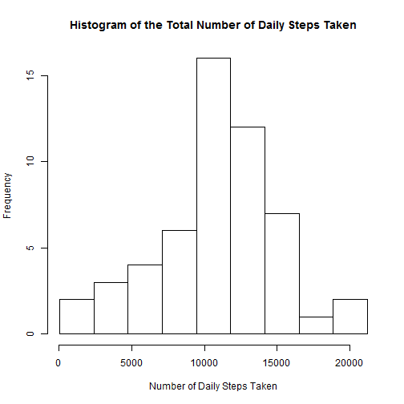
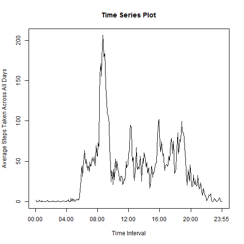
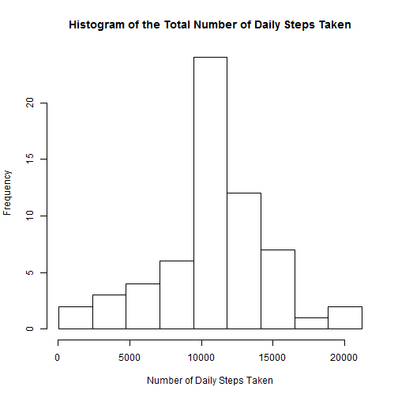
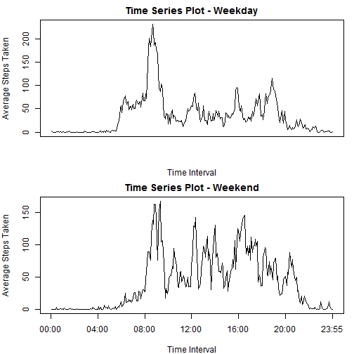

## Introduction

        It is now possible to collect a large amount of data about personal movement using activity monitoring devices such as a Fitbit, Nike Fuelband, or Jawbone Up. These type of devices are part of the "quantified self" movement -- a group of enthusiasts who take measurements about themselves regularly to improve their health, to find patterns in their behavior, or because they are tech geeks. But these data remain under-utilized both because the raw data are hard to obtain and there is a lack of statistical methods and software for processing and interpreting the data.

        This assignment makes use of data from a personal activity monitoring device. This device collects data at 5 minute intervals through out the day. The data consists of two months of data from an anonymous individual collected during the months of October and November, 2012 and include the number of steps taken in 5 minute intervals each day.

## Data

The data for this assignment can be downloaded from the course web site:

- Dataset: [Activity monitoring data](https://d396qusza40orc.cloudfront.net/repdata%2Fdata%2Factivity.zip) [52K]

The variables included in this dataset are:

- steps: Number of steps taking in a 5-minute interval (missing values are coded as NA)

- date: The date on which the measurement was taken in YYYY-MM-DD format

- interval: Identifier for the 5-minute interval in which measurement was taken

The dataset is stored in a comma-separated-value (CSV) file and there are a total of 17,568 observations in this dataset.

## Assignment

###1. Loading and preprocessing the data

Downloading the data into the /data folder under the working directory 

```r
if(!file.exists("./data")){dir.create("./data")}
fileUrl<-"http://d396qusza40orc.cloudfront.net/repdata%2Fdata%2Factivity.zip"
download.file(fileUrl,destfile="./data/activity.zip", mode="wb")
```

Unzip the file and format the date column as date class

```r
unzip("./data/activity.zip", exdir = "./data")
data <- read.csv("./data/activity.csv")
data$date <- as.Date(data$date, "%Y-%m-%d")
```

###2. What is mean total number of steps taken per day?  

- Make a histogram of the total number of steps taken each day  

```r
dailystep <- tapply(data$steps, data$date, sum)
temp <- dailystep[!is.na(dailystep)]
hist(temp, breaks=seq(min(temp), max(temp), l = 10 ), 
     main="Histogram of the Total Number of Daily Steps Taken", xlab="Number of Daily Steps Taken")
```

 

- Calculate and report the mean and median total number of steps taken per day   

```r
mean(dailystep, na.rm=TRUE)
```

```
## [1] 10766.19
```

```r
median(dailystep, na.rm=TRUE)
```

```
## [1] 10765
```

###3. What is the average daily activity pattern?  

- Make a time series plot (i.e. type = "l") of the 5-minute interval (x-axis) and the average number of steps taken, averaged across all days (y-axis)

```r
interval <- tapply(data$steps, data$interval, mean, na.rm=TRUE)
plot(c(1:288), interval, type="l", main="Time Series Plot", xlab="Time Interval", ylab="Average Steps Taken Across All Days", xaxt = "n")
axis(side = 1, at=c(0,48,96,144,192,240, 288), labels=c("00:00","04:00","08:00","12:00","16:00","20:00","23:55"))
```

 

- Which 5-minute interval, on average across all the days in the dataset, contains the maximum number of steps?  
-- Answer: 8:35 AM

```r
interval[match(max(interval),interval)]
```

```
##      835 
## 206.1698
```

###4. Inputing missing values  

- Calculate and report the total number of missing values in the dataset (i.e. the total number of rows with NAs)

```r
sum(is.na(data$step))
```

```
## [1] 2304
```

- Devise a strategy for filling in all of the missing values in the dataset. The strategy does not need to be sophisticated. For example, you could use the mean/median for that day, or the mean for that 5-minute interval, etc.  
-- Strategy: All the missing values in the steps column will be filled in with the mean for that 5-minute interval across all days

- Create a new dataset that is equal to the original dataset but with the missing data filled in.

```r
newdata <- data
newdata$steps[is.na(newdata$steps)] <- interval[match(newdata$interval, names(interval))]
```

- Make a histogram of the total number of steps taken each day and Calculate and report the mean and median total number of steps taken per day. 

```r
newdailystep <- tapply(newdata$steps, newdata$date, sum)
hist(newdailystep, breaks=seq(min(newdailystep), max(newdailystep), l = 10 ), 
     main="Histogram of the Total Number of Daily Steps Taken", xlab="Number of Daily Steps Taken")
```

 

```r
mean(newdailystep)
```

```
## [1] 10766.19
```

```r
median(newdailystep)
```

```
## [1] 10766.19
```
- Do these values differ from the estimates from the first part of the assignment?   
-- Answer: Both mean and median are very close to what they were before the NA values are being filled in  

- What is the impact of inputing missing data on the estimates of the total daily number of steps?   
-- Answer: Other than making the the histogram more concentrated towards the mean, there is not whole lot of impact.  

###5. Are there differences in activity patterns between weekdays and weekends?

- Answer: Yes. The average number of steps taken during the office hour (10:00AM - 05:00PM) is a lot higher on weekends than on weekdays.
Also, the acitivity level before 8:00AM is a lot lower on weekends than on weekdays.

- Create a new factor variable in the dataset with two levels -- "weekday" and "weekend" indicating whether a given date is a weekday or weekend day.  

```r
newdata$weekday <- "weekday"
newdata$weekday[which(weekdays(newdata$date)== "Saturday" | weekdays(newdata$date) == "Sunday")] <- "weekend"
newdata$weekday <- as.factor(newdata$weekday)
```

- Make a panel plot containing a time series plot (i.e. type = "l") of the 5-minute interval (x-axis) and the average number of steps taken, averaged across all weekday days or weekend days (y-axis).  

```r
newinterval <- with(newdata, tapply(steps, list(interval, weekday), mean, na.rm=TRUE))
par(mfrow = c(2,1), mar = c(4,4,2,1))
plot(c(1:288), newinterval[,1], type="l", main="Time Series Plot - Weekday", xlab="Time Interval", ylab="Average Steps Taken", xaxt = "n")
plot(c(1:288), newinterval[,2], type="l", main="Time Series Plot - Weekend", xlab="Time Interval", ylab="Average Steps Taken", xaxt = "n")
axis(side = 1, at=c(0,48,96,144,192,240, 288), labels=c("00:00","04:00","08:00","12:00","16:00","20:00","23:55"))
```

 
